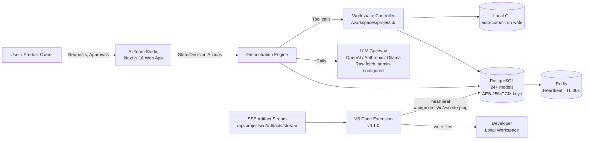
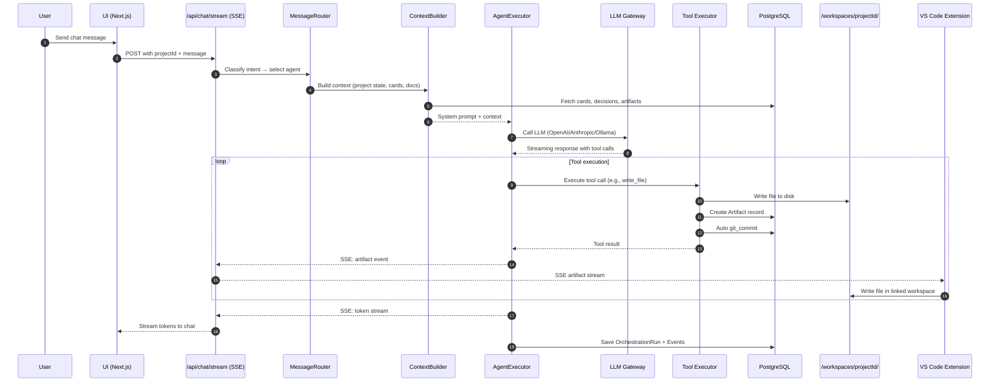
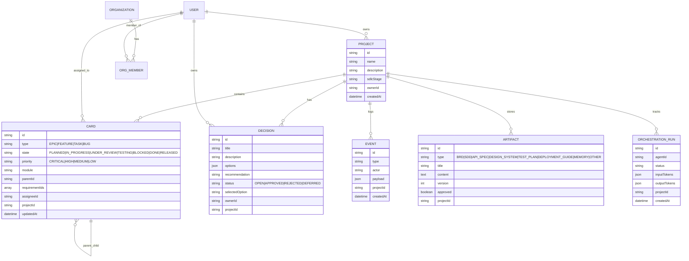
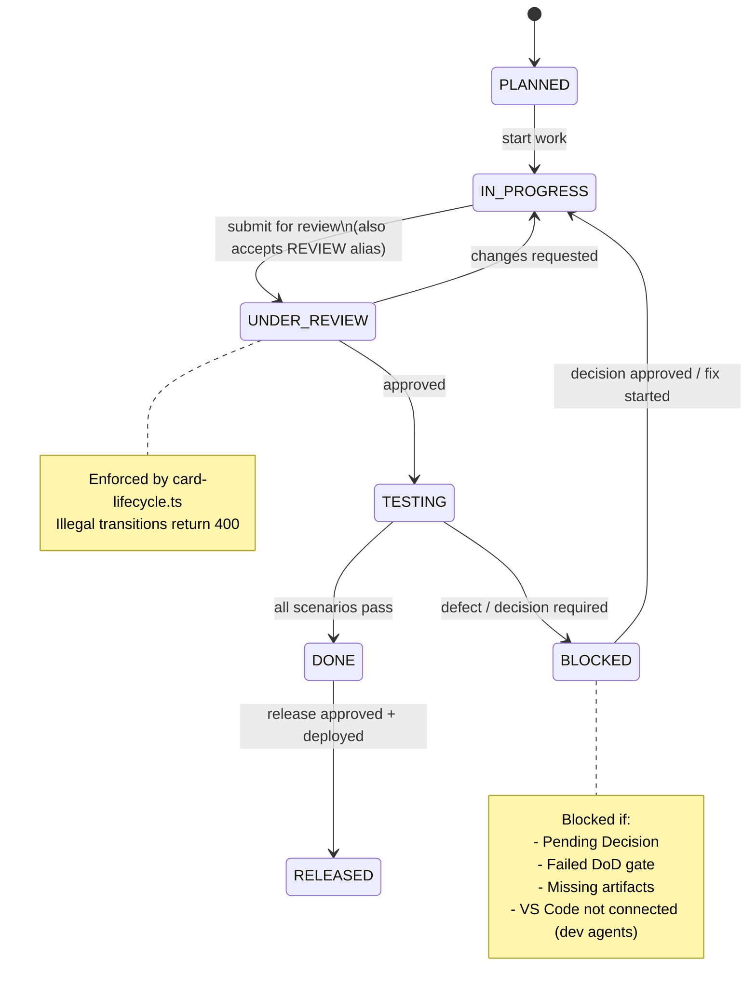
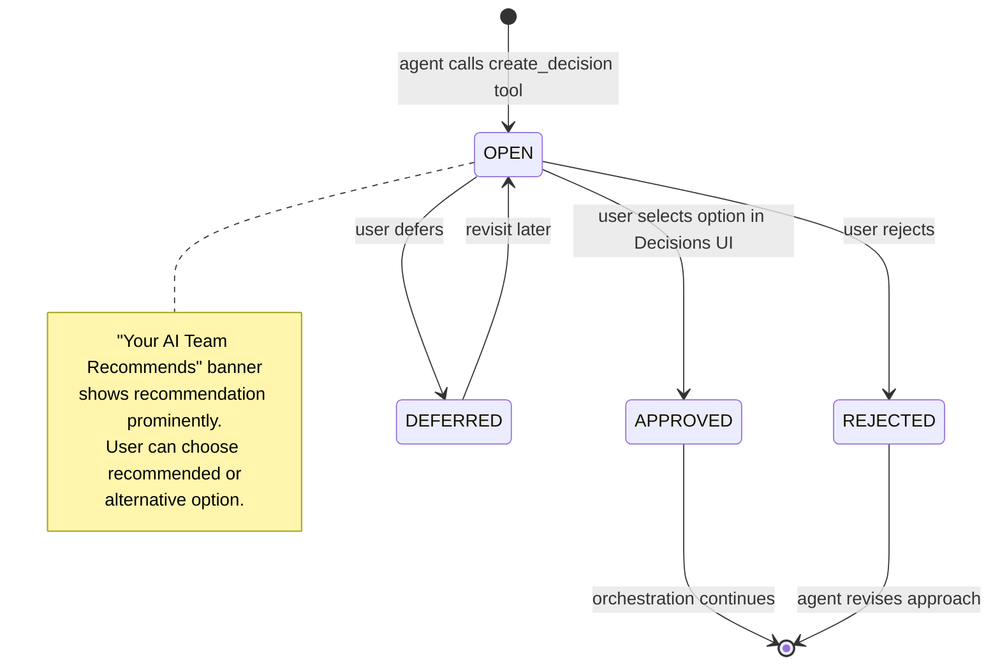
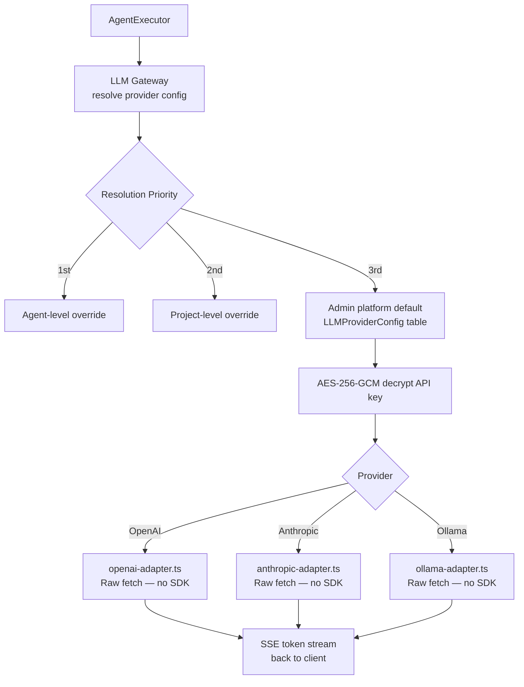
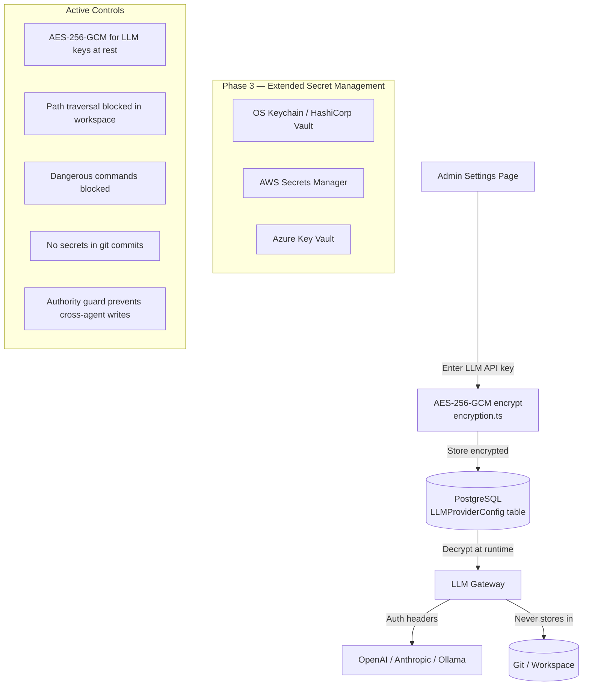
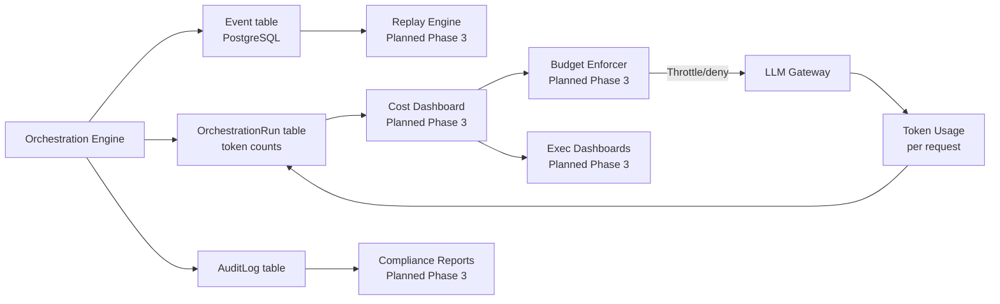

# 34. Architecture Diagrams

> **Implementation Status (2026-03-27):** Diagrams updated to reflect actual built architecture. The system is a Next.js 16 monolith with PostgreSQL, not a split FastAPI/Node.js architecture. VS Code extension handles file delivery. Multi-tenant SaaS and distributed agent modes are planned.

All diagrams below are in Mermaid format. Render them in any Mermaid-compatible viewer (GitHub, Mermaid Live Editor, MkDocs, Docusaurus).

**Diagram conventions:**
- Solid arrows: primary control flow
- Dotted arrows: read-only / reference
- Orange nodes: governance/control
- Blue nodes: delivery personas
- Green nodes: platform/ops

---

## 34.1 System Context Diagram (Actual — 2026-03-27)



---

## 34.2 High-Level Component Architecture (Actual)

```mermaid
flowchart TB
  subgraph FE[Frontend — Next.js 16 App Router]
    UI[12 Platform Pages]
    CHAT[SSE Streaming Chat]
    BOARD[Drag-Drop Kanban]
    CMD[Command Palette cmdk]
  end

  subgraph API[API Routes]
    STREAM[/api/projects/id/chat/stream SSE]
    ASTREAM[/api/projects/id/artifacts/stream SSE]
    PING[/api/projects/id/vscode-ping]
    REST[REST: projects/cards/decisions/agents/git/admin]
  end

  subgraph ORCH[Orchestration Engine]
    MR[MessageRouter\nclassify intent → pick agent]
    CB[ContextBuilder\nfetch project data → system prompt]
    AE[AgentExecutor\ncall LLM via Gateway]
    LLM[LLM Gateway\nresolve admin config → provider]
    CL[card-lifecycle.ts\ntransition validation]
    AG[authority-guard.ts\nwrite permission check]
    LD[loop-detector.ts\nfuzzy + repetition + reask]
    QG[quality-gates.ts\nDoD enforcement]
  end

  subgraph AGENTS[23 Agent Definitions]
    GOVC[Governance: ORC/SC/DEC/AUD/SEC]
    SDLC[SDLC: BA/SA/UX/PM/TL]
    ENG[Engineering: JD/SD/QA/AT/PF]
    PLAT[Platform: PE/DO/IE/SM/SR]
    AI[AI/Cost: CA/PE/TA]
  end

  subgraph TOOLS[Tool System]
    FS[write_file / edit_file / read_file\nlist_directory / glob / grep]
    GIT[git_commit / git_branch / git_diff]
    SHELL[run_command / run_tests / run_build]
    PROJ[create_card / update_card / create_document\ncreate_decision / remember]
    COMM[consult_agent / ask_user]
  end

  subgraph STORAGE[Storage]
    PG[(PostgreSQL port 14000\nPrisma 7.x — 24+ models)]
    DISK[/workspaces/projectId/\nAgent-generated source files]
    REDIS[(Redis\nHeartbeat + BullMQ)]
  end

  subgraph VSCODE[VS Code Extension v0.1.0]
    WM[WorkspaceManager\nSSE consumer + file writer]
    HB[Heartbeat\nPOST every 25s → Redis 30s TTL]
    VIEWS[TreeView: Projects/Agents/Chat]
  end

  UI --> API
  CHAT --> STREAM
  BOARD --> REST
  CMD --> REST
  STREAM --> MR
  MR --> CB
  CB --> AE
  AE --> LLM
  LLM --> AGENTS
  AGENTS --> TOOLS
  TOOLS --> FS
  TOOLS --> GIT
  FS --> DISK
  GIT --> DISK
  AE --> CL
  AE --> AG
  AE --> LD
  AE --> QG
  ORCH --> PG
  ASTREAM --> VSCODE
  WM --> HB
  HB --> REDIS
  PING --> REDIS
```

---

## 34.3 Orchestration Sequence (Actual)



---

## 34.4 Artifacts & Data Model (ER Diagram — Actual PostgreSQL)



---

## 34.5 Card State Machine (Actual Implementation)



---

## 34.6 Decision Lifecycle (Actual)



---

## 34.7 VS Code Extension Integration Flow

```mermaid
flowchart LR
  subgraph WEBAPP[Web App — Next.js 16]
    CHAT[Agent generates code\nvia write_file tool]
    ARTIFACT[Artifact saved to PostgreSQL\n+ written to /workspaces/projectId/]
    SSE[SSE: /api/projects/id/artifacts/stream\nartifact event emitted]
    PING[/api/projects/id/vscode-ping\nRedis TTL 30s heartbeat]
  end

  subgraph VSCODE[VS Code Extension v0.1.0]
    WM[WorkspaceManager\nlistens to SSE stream]
    HB[Heartbeat\nPOST every 25s]
    FW[File Writer\nwrites to linked folder]
    FT[FileTracker\nprevents duplicates]
    OPEN[Opens new files\nin editor]
  end

  subgraph DEVAGENT[Dev Agents Gate]
    BLOCK{VS Code\nConnected?}
    YES[JD / SD / QA / TL / DO / SEC\ncan execute]
    NO[Dev agents\nblocked]
  end

  CHAT --> ARTIFACT
  ARTIFACT --> SSE
  SSE --> WM
  WM --> FW
  FW --> FT
  FT --> OPEN
  HB --> PING
  PING --> BLOCK
  BLOCK -->|Yes| YES
  BLOCK -->|No| NO
```

---

## 34.8 LLM Gateway (Actual)



---

## 34.9 Deployment Topology (Current + Planned)

```mermaid
flowchart LR
  subgraph CURRENT[Current — Dev Mode]
    UI1[Browser\nlocalhost:3000] --> NX1[Next.js 16\nTurbopack]
    NX1 --> PG1[(PostgreSQL\nDocker port 14000)]
    NX1 --> R1[(Redis\nDocker)]
    NX1 --> WS1[/workspaces/\nLocal disk]
    WS1 --> GIT1[(Local Git\nauto-commit)]
    NX1 -->|Raw fetch| LLM1[OpenAI/Anthropic/Ollama]
    VSC1[VS Code Extension\nv0.1.0] -->|SSE + Heartbeat| NX1
    VSC1 --> WS1
  end

  subgraph PLANNED[Phase 3 — SaaS]
    UI2[Browser] --> CDN2[CDN / Load Balancer]
    CDN2 --> NX2[Next.js\nCloud instances]
    NX2 --> PG2[(PostgreSQL\nManaged cloud DB)]
    NX2 --> R2[(Redis\nManaged)]
    NX2 --> S3[Cloud Storage\nWorkspaces]
    NX2 -->|BYOM| LLM2[LLM Gateway\nOpenAI/Anthropic/Ollama/Custom]
    NX2 --> BQ2[BullMQ Workers\nParallel agents]
    VSC2[VS Code Extension] -->|SSE + Heartbeat| NX2
  end
```

---

## 34.10 Security & Secrets Flow (Actual)



---

## 34.11 Observability & Cost Governance (Target State)


